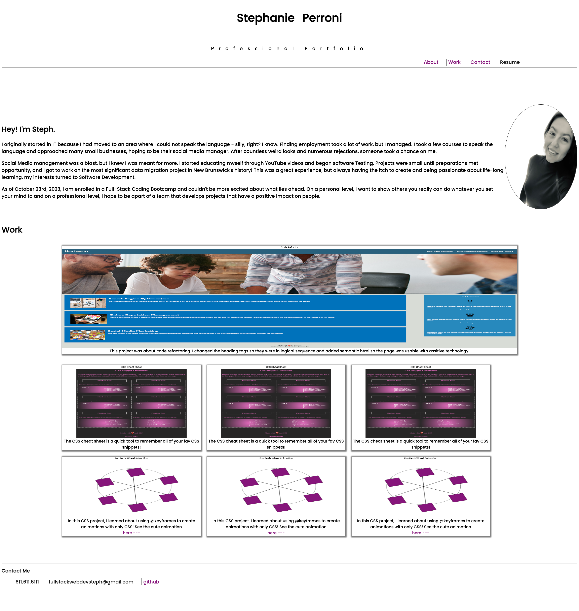

# stephanie-perroni-pro-portfolio

## This is the first iteration of my personal projects portfolio.

This includes projects I've completed as well as place holder cards to home future projects. As you click each link, you will be brought to the coressponding section.

## Upcomming iterations.

1. I Will include more Projects
2. Resume edits
3. "About me" section updates

## Image of Portfolio

# 

## Video Sample of Portfolio Nov 13 2023

Follow this link https://youtu.be/atIgqUd4Eeo to see a brief clip of what the first iteration of my Professional Portfolio looks like!

## Here is the live link: https://fswdevsteph.github.io/stephanie-perroni-pro-portfolio/ to an external site.

## Instalation instructions

N/A

## Contributers

N/a

## Known Issues

N/A

## About Developer

As someone with Multiple Sclerosis, the cognitive issues I face and overcome on a daily basis can really hinder my progress but where there is a will there is a way! From vegetable (at one point ) to victor, if you're a fan of my project project and would like to help efforts on this journey, you can make a donation here: www.thisisafakelinkthatgoesnowhere.com

[def]: sp-portfolio.png
